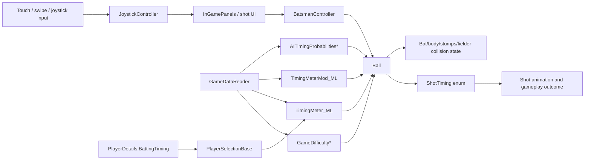

# Unity IL2CPP Gameplay Timing Architecture Findings

## Scope and safety boundary

This repository currently contains a reconstructed `Assembly-CSharp.dll` dummy assembly. The findings below are static metadata correlations: class names, field names, method names, inheritance, and RVA values recovered from the managed metadata. They are intended for architecture reconstruction, offline telemetry planning, and educational observability. This report deliberately avoids instructions for bypassing protections, modifying online gameplay, or forcing gameplay outcomes.

## High-confidence timing-related systems

| System / class | Namespace | Evidence | Probable role | Confidence |
|---|---:|---|---|---:|
| `Ball` | global | `UnityEngine.MonoBehaviour`, `m_TimingMeter`, `m_ShotTiming`, `kPerfectShotRange`, `ResolveBatsmanAIShot`, `ResolveBatsmanUserShot`, `CalculateTimingMeterParameters`, `UpdateTimingMeterUI_ML` | Central in-play ball lifecycle and shot/timing evaluation coordinator. Likely owns the final shot timing category and collision result state. | High |
| `ShotTiming` | global | enum values `EARLY`, `EARLY_PERFECT`, `PERFECT`, `LATE_PERFECT`, `LATE` | Final shot timing category enum. | High |
| `GameDifficulty`, `GameDifficulty_New`, `GameDifficulty_New_Test` | global | fields `BatTimingManipulation`, `PerfectTimingManipulation`, `RangeReduction`, `CollisionScaleReduction`, `ForceIncrement` as ACTk `ObscuredFloat` | Data-driven difficulty/balancing models. Timing windows appear difficulty-adjusted. | High |
| `TimingMeter_ML` | global | `ratingMin`, `ratingMax`, `Early`, `EarlyPerfect`, `Perfect`, `LatePerfect`, `Late` | Rating-bucket timing-meter baseline table. | High |
| `TimingMeterMod_ML` | global | `BatsmanCategory`, `ShotType`, `Early`, `EarlyPerfect`, `Perfect`, `LatePerfect`, `Late`, `Edges`, `Collision` | Modifier table by batsman category and shot type. | High |
| `TimingMeterPercentages` | global | class name and focus match | Likely UI or computed timing percentage DTO for meter slices. | Medium |
| `GameDataReader` | global | `m_UserBattingDifficulty`, `m_AITimingProbabilities`, `m_AITimingProbabilities_Mod`, `m_AITimingProbabilities_Green`, `m_BatsmanShotDatas`, `GetTimingMeterData_ML`, `GetTimingMeterModData_ML` | Singleton/data-reader for gameplay config tables, shot data, timing meter data, and AI probability data. | High |
| `PlayerDetails` | global | `BattingTiming`, `BattingTechnique`, `BattingAggression`, `BatsmanType` as ACTk fields | Player attribute record. Feeds batting rating/timing and timing-meter selection. | High |
| `PlayerSelectionBase` | global | `get_PlayerBattingTiming`, `get_PlayerBattingTechnique`, `get_PlayerBattingPercentage` | UI/domain accessor layer over `PlayerDetails` batting attributes. | Medium |
| `BatsmanController` | global | `m_CurrentShotType`, `kBatsmanMoveRange`, `PlayShot`, batting animation names in metadata | Batsman control/animation executor; likely receives selected/evaluated shot. | High |
| `InGamePanels` | global | `_timingMeter`, `TimingMeter_PerfectImage`, `TimingMeter_EarlyPerfectImage`, `TimingMeter_EarlyImage`, `TimingMeter_LatePerfectImage`, `TimingMeter_LateImage`, `Update` | Runtime UI owner for timing-meter display slices. | High |
| `JoystickController` | global | `_posInput`, `OnJoystickAngleUpdated`, `angleUpdated(float,bool)` | Touch/joystick directional input component. | Medium |

## Relationship map

## Probable data flow

1. **Config load**: `GameDataReader` loads shot matrices, batting difficulty tables, AI probability tables, and timing-meter tables.
2. **Player attribute lookup**: `PlayerDetails.BattingTiming` and related batting fields are accessed by UI/selection components such as `PlayerSelectionBase`.
3. **Input acquisition**: `JoystickController` tracks directional input and emits angle updates; other input components are likely present but need narrower follow-up scans for Unity Input System callback names.
4. **Shot selection**: `BatsmanController` tracks current shot type and animation-related state; `Ball.ResolveBatsmanUserShot` / `Ball.ResolveBatsmanAIShot` indicate user and AI shot resolution paths.
5. **Timing-meter parameterization**: `Ball.CalculateTimingMeterParameters`, `TimingMeter_ML`, `TimingMeterMod_ML`, and `GameDifficulty*` fields likely combine rating buckets, shot type, player category, and difficulty modifiers into early/perfect/late timing windows.
6. **Shot timing categorization**: `Ball.m_ShotTiming` stores an ACTk-protected integer corresponding to the `ShotTiming` enum.
7. **Outcome resolution**: `Ball.ResolveBatCollision`, `m_BatCollisionType`, `m_BatCollisionRegion`, `kPerfectShotRange`, force/projection fields, and fielder/stump/body collision booleans indicate that timing feeds collision and outcome calculations.
8. **UI feedback**: `InGamePanels` owns timing-meter image slices; `Ball.UpdateTimingMeterUI_ML` likely updates the ML-specific timing-meter UI.

## Timing-system hypotheses

| Hypothesis | Evidence | Confidence |
|---|---|---:|
| Timing is threshold/window-based. | `TimingMeter_ML` and `TimingMeterMod_ML` contain named buckets `Early`, `EarlyPerfect`, `Perfect`, `LatePerfect`, `Late`; `ShotTiming` mirrors those categories. | High |
| Timing windows are data-driven by difficulty and player rating. | `GameDifficulty*` exposes `BatTimingManipulation` and `PerfectTimingManipulation`; `TimingMeter_ML` has `ratingMin` / `ratingMax`; `PlayerDetails` has `BattingTiming`. | High |
| AI shot timing is probabilistic. | `GameDataReader` contains `m_AITimingProbabilities*`; `Ball` exposes `ResolveBatsmanAIShot`; known method names include `GetAIShotTiming`. | High |
| Final gameplay result is also physics/collision constrained, not only timing-category constrained. | `Ball` owns collision booleans, bat collision type/region, force/projection fields, and perfect-shot range. | Medium-High |
| Input timing is synchronized to ball-release / bat-hit timestamps. | ML fields include `TimeSinceBallReleased_shotplayed_ML` and `TimeSinceBallReleased_BatHit_ML`. | Medium |
| Animation timing participates in result timing. | `Ball` has `BatsmanAnimSpeedOffset_ML`, `BatsmanAnimIndex_ML`; `BatsmanController` likely executes `PlayShot`; many animation callbacks exist. | Medium |

## ACTk / ObscuredTypes summary

The scan found 363 types with ACTk/CodeStage-related fields, including gameplay-critical classes:

- `Ball`: protected `m_ShotTiming`, bat/body/stumps/fielder hit booleans, bat collision type/region, shot angle, perfect-shot range, force, and projection fields.
- `BatsmanController`: protected current shot type, movement range, RBW flags, and boundary-hit state.
- `PlayerDetails`: protected batting timing, batting technique, batting aggression, batting hand, and many player identity/appearance fields.
- `GameDifficulty*`: protected timing and difficulty-balancing floats.
- `TimingMeter_ML` / `TimingMeterMod_ML`: protected timing-window thresholds and modifier fields.

Type counts by protected type in the current scan:

| Protected type | Field count |
|---|---:|
| `ObscuredInt` | 626 |
| `ObscuredString` | 551 |
| `ObscuredBool` | 197 |
| `ObscuredFloat` | 160 |
| `ObscuredDouble` | 18 |

## Research-safe observability plan

A research-safe demonstration should prefer an **external telemetry/training overlay** over an inbuilt modified binary. Recommended scope:

- Read static metadata and render class/timing architecture diagrams.
- Add offline instrumentation in a controlled lab build only if source/build permission exists.
- Build a training overlay that visualizes predicted timing windows from extracted configuration and replay/telemetry logs.
- Do not patch game binaries, bypass ACTk, inject hooks into protected runtime values, or alter multiplayer/online outcomes.

## Next investigation steps

1. Locate and parse any `script.json`, `dump.cs`, `il2cpp.h`, or metadata dump artifacts if they are added later; those will provide richer RVAs and native method offsets than this dummy DLL alone.
2. Run `scripts/il2cpp_static_scan.py` after every dump refresh and compare `reports/timing_scan.json` deltas.
3. Narrow input-flow research with keyword scans for `InputAction`, `Touch`, `Swipe`, `Pointer`, `OnDrag`, `OnPointer`, and joystick event subscribers.
4. Narrow timing-meter research around `Ball.CalculateTimingMeterParameters`, `Ball.UpdateTimingMeterUI_ML`, `GameDataReader.GetTimingMeterData_ML`, and `GameDataReader.GetTimingMeterModData_ML`.
5. Build an offline notebook or dashboard from `reports/timing_scan.json` to correlate `PlayerDetails.BattingTiming`, difficulty modifiers, timing-meter buckets, and final `ShotTiming` categories.
